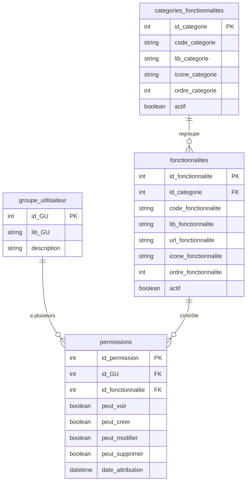
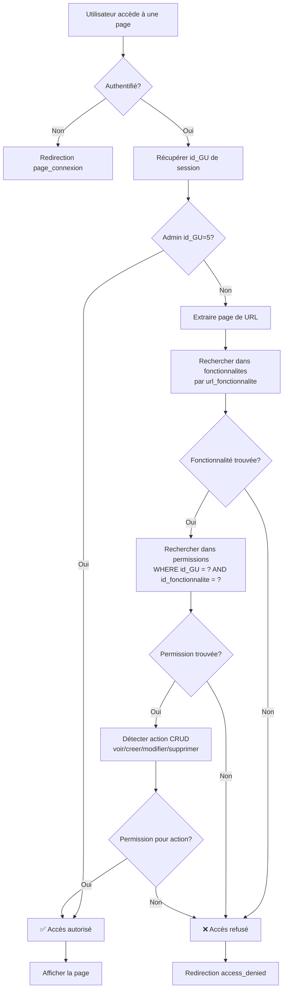
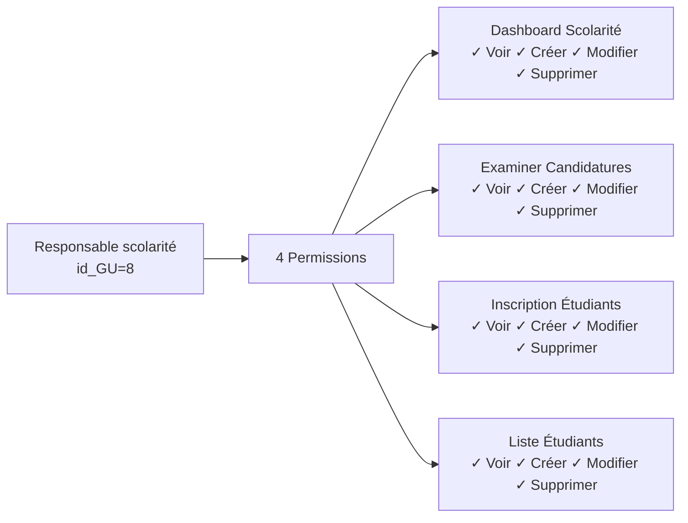
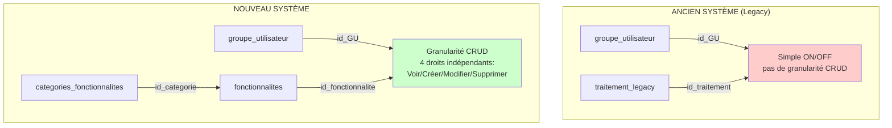
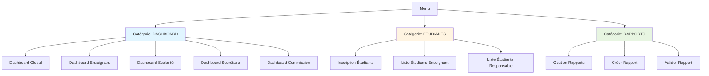

# Schéma du Système de Permissions

## Architecture Actuelle



## Flux de Vérification des Permissions



## Exemple de Données

### Groupe: Responsable scolarité (id_GU = 8)



## Comparaison Ancien vs Nouveau Système



## Menu Hiérarchique



## Statistiques

| Élément               | Ancien Système            | Nouveau Système                              |
| --------------------- | ------------------------- | -------------------------------------------- |
| **Tables**            | 2 (traitement, rattacher) | 3 (categories, fonctionnalites, permissions) |
| **Granularité**       | Binaire (ON/OFF)          | CRUD (4 droits)                              |
| **Fonctionnalités**   | ~51                       | 52                                           |
| **Catégories**        | 0                         | 12                                           |
| **Permissions Admin** | ~51                       | 52 × 4 = 208 droits                          |
| **Hiérarchie**        | Non                       | Oui (menu par catégories)                    |
| **Middleware**        | Non                       | Oui (vérification automatique)               |

## Fichiers Clés

```
app/
├── middlewares/
│   └── PermissionMiddleware.php    (Vérification automatique)
├── models/
│   ├── Permission.php               (CRUD permissions)
│   ├── Fonctionnalite.php          (Gestion fonctionnalités)
│   └── Categorie.php                (Gestion catégories)
├── controllers/
│   ├── MenuController.php           (Menu hiérarchique)
│   └── ParametreController.php      (Attribution UI)
└── utils/
    └── permissions_helper.php       (Fonctions canView, canCreate, etc.)

public/
├── layout.php                       (Intégration middleware)
└── menu.php                         (Affichage menu)

ressources/views/
└── parametres_generaux/
    └── gestion_attribution.php      (Interface attribution CRUD)
```
