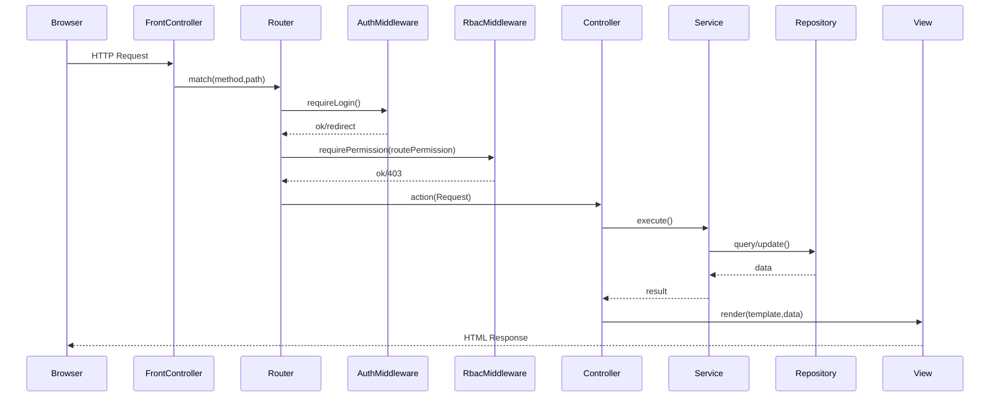

# Reprise du projet (PHP vanilla) : MVC + Router + Services + RBAC

## Objectifs

- Stabiliser une **architecture propre** (Router → Controller → Service → Repository/Model → View).
- Mettre en place une **gestion fiable des écrans** (pages + sous-pages/actions) et des **menus/sous-menus** (catégories).
- Ajouter un **espace d’administration** pour gérer catégories, fonctionnalités (écrans) et permissions CRUD par groupe.
- Corriger les **failles** et **bugs** déjà identifiés (CSRF, autorisations, audit, mots de passe, IDOR, sessions, backup).

## Constats clés (base existante)

- Le routing actuel est centralisé dans `public/layout.php` (gros `switch`) et des includes de `ressources/routes/*.php`.
- Le modèle RBAC/menus existe dans la DB **uniquement** dans `ufrmi1802974_2q2mpf (1).sql` via `categories_fonctionnalites`, `fonctionnalites`, `permissions`.
- Les contrôles d’accès actuels sont **fragiles** (heuristiques d’action, sous-pages `&action=` mal alignées avec les checks, CSRF non validé).

## Architecture cible (sans framework)

### Arborescence proposée (migration progressive)

- `public/index.php` : **front controller** (nouveau) qui initialise l’app et délègue au router.
- `app/Core/`
  - `App.php` (bootstrap)
  - `Router.php` (définition routes)
  - `Request.php` / `Response.php`
  - `Session.php` (session hardening)
  - `Csrf.php`
- `app/Http/Controllers/` : contrôleurs (nouveau namespace), migration des contrôleurs existants au fil de l’eau.
- `app/Domain/Services/` : services métier (validation workflow, règles)
- `app/Infrastructure/Repositories/` : accès DB (PDO) avec requêtes préparées
- `app/Security/`
  - `AuthService.php` (login/logout, regeneration session)
  - `AuthorizationService.php` (RBAC strict)
- `ressources/views/` : conservé (vues), mais les vues ne doivent plus contenir de logique métier.

### Flux requête → réponse (cible)

## Gestion menus / sous-menus / écrans (cible)

### Modèle de données (on réutilise l’existant)

- `categories_fonctionnalites` = **menus** (catégories)
- `fonctionnalites` = **écrans** (pages) et **sous-écrans** (actions) via `est_sous_page` + `page_parente`
- `permissions` = droits CRUD par `id_GU` et `id_fonctionnalite`

### Règles d’implémentation

- Le menu est construit depuis DB via `AuthorizationService`:
  - afficher uniquement les fonctionnalités où `peut_voir=1`.
  - ne pas confondre “cacher le lien” et “autoriser l’action”: chaque route/action doit être contrôlée côté serveur.
- On **arrête la déduction heuristique** (`detectAction`) et on passe à un mapping explicite:
  - chaque route déclare `required_permission` (voir/creer/modifier/supprimer) et `code_fonctionnalite`.

## Back-office permissions (écrans à créer)

- **Catégories**: CRUD sur `categories_fonctionnalites` (ordre, icône, actif)
- **Fonctionnalités (écrans)**: CRUD sur `fonctionnalites` (page, sous-page/action, ordre, actif, parent)
- **Permissions**: matrice Groupe × Fonctionnalité avec CRUD (toggle)
- **Outils**:
  - bouton “Donner toutes permissions à Admin” (équivalent de `fix_permissions_admin.sql`, mais via UI + logs)

## Correctifs sécurité/bugs (ce qui sera corrigé)

### Auth/Session

- Validation CSRF côté serveur (au minimum login + formulaires sensibles).
- `session_regenerate_id(true)` au login, cookies `HttpOnly`, `SameSite`, `Secure` si HTTPS.
- Rate-limit basique des tentatives de login (même simple, en DB ou session).

### RBAC

- Suppression du **super-admin codé en dur** (`id_GU==5`) au profit d’un flag/permission (ou d’un groupe “Administrateur” reconnu en DB).
- Contrôle d’accès par **route/action** (et non par `?page=` uniquement).
- Sous-pages `?page=X&action=Y` traitées comme des fonctionnalités distinctes si voulu.

### Bugs fonctionnels actuels

- Fix `AuthController` ↔ `Utilisateur::updatePassword` (ordre des paramètres).
- Fix `AuditLog::logAction` et ses appels (signature cohérente), et alignement `statut_action` (enum) avec les valeurs réellement envoyées.
- Correction de la journalisation “accès refusé” (éviter crash).

### Données/IDOR

- Vérifs “ownership”/périmètre (niveau d’accès) pour toute action basée sur un `id` en GET (ex: impression reçus, pdf).

### Backup/Restore

- Accès strict admin + CSRF + journalisation.
- Réduction de surface: éviter `shell_exec/system` si possible, sinon verrouillage fort.

### Mots de passe

- Remplacer la génération via `rand()` par `random_bytes()`.
- Éviter l’envoi de mot de passe en clair par email: basculer vers **lien de création/réinitialisation** (token stocké en DB comme déjà prévu via `password_resets`).

## Stratégie de migration progressive (sans casser l’existant)

### Phase 0 — Préparation

- Ajouter le nouveau noyau `public/index.php` + `app/Core/*`.
- Conserver `public/layout.php` au début, mais permettre au router de “déléguer” vers l’existant.

### Phase 1 — Sécurité minimale immédiate

- CSRF: vérif dans `public/login.php` + ajout d’un helper CSRF réutilisable.
- Session hardening au login/logout.
- Corriger `updatePassword`, audit, et logs incohérents.

### Phase 2 — RBAC fiable

- Introduire `AuthorizationService` qui lit `permissions/fonctionnalites/categories`.
- Mettre à jour le contrôle d’accès pour qu’il soit **déclaratif** par route.
- Mettre à jour la génération du menu pour qu’elle reflète exactement les routes autorisées.

### Phase 3 — Back-office permissions/menus/écrans

- Créer les écrans d’administration (Catégories, Fonctionnalités, Permissions) sous une zone “Administration”.
- Logs d’audit à chaque changement.

### Phase 4 — Migration écran par écran

- Pour chaque `?page=...` important:
  - créer une route dédiée
  - déplacer logique du contrôleur vers un service
  - sécuriser (RBAC + CSRF si POST)
  - garder la vue existante puis refactor au besoin

## Fichiers existants “points chauds” (à migrer/traiter en premier)

- `public/layout.php` (routing + inclusion + checks)
- `app/middlewares/PermissionMiddleware.php` (à déprécier)
- `app/utils/permissions_helper.php` (à remplacer par helpers basés sur `AuthorizationService`)
- `public/login.php`, `public/page_connexion.php` (CSRF + session)
- `app/controllers/SauvegardeRestaurationController.php` (surface critique)
- `app/controllers/GestionUtilisateurController.php` (création users + emails)

## Plan de tests (léger)

- Smoke test login/logout + session.
- Vérifier qu’un rôle sans droits:
  - ne voit pas les menus
  - ne peut pas appeler les routes directement (403/redirect)
- Vérifier création/modification/suppression sur 2-3 écrans clés.
- Vérifier impression PDF: impossible d’accéder à un ID non autorisé.